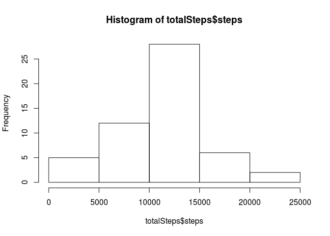
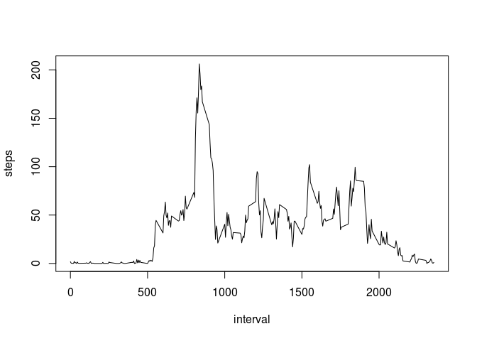
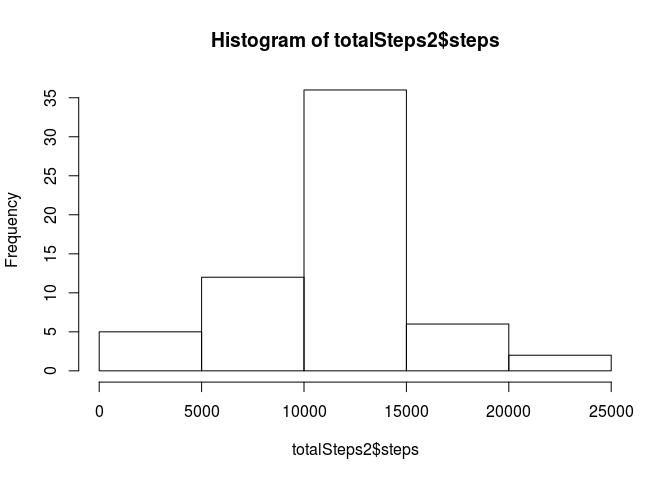
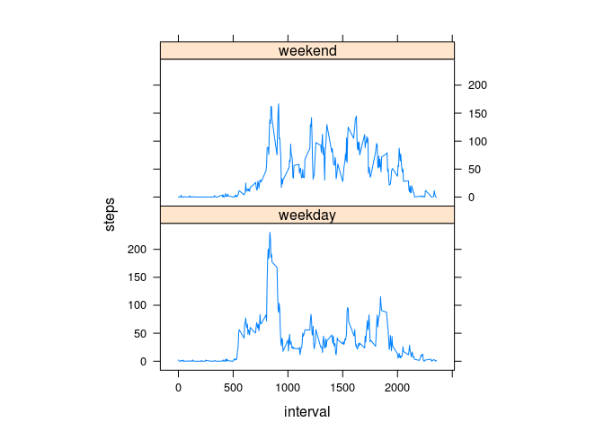

# Reproducible Research: Peer Assessment 1


## Loading and preprocessing the data

1. Load the data (i.e. read.csv())

2. Process/transform the data (if necessary) into a format suitable for your analysis


```r
unzip("activity.zip")
activity <- read.csv("activity.csv")
```

## What is mean total number of steps taken per day?

1. Calculate the total number of steps taken per day


```r
totalSteps <- aggregate(steps ~ date, data = activity, sum, na.rm = TRUE)
```

2. Make a histogram of the total number of steps taken each day


```r
hist(totalSteps$steps)
```

<!-- -->

3. Calculate and report the mean and median total number of steps taken per day 


```r
mean(totalSteps$steps)
```

```
## [1] 10766.19
```

```r
median(totalSteps$steps)
```

```
## [1] 10765
```

* The **mean** total number of steps taken per day is 
    1.0766189\times 10^{4} steps.
* The **median** total number of steps taken per day is 
    10765 steps.

## What is the average daily activity pattern?

1. Make a time series plot (i.e. type = "l") of the 5-minute interval (x-axis) and the average number of steps taken, averaged across all days (y-axis)


```r
stepsInterval <- aggregate(steps ~ interval, data = activity, mean, na.rm = TRUE)
plot(steps ~ interval, data = stepsInterval, type = "l")
```

<!-- -->

2. Which 5-minute interval, on average across all the days in the dataset, contains the maximum number of steps? 


```r
stepsInterval[which.max(stepsInterval$steps),]$interval
```

```
## [1] 835
```

The 835th interval contains, on average across all the days in the dataset, the maximum number of steps.

## Imputing missing values

1. Calculate and report the total number of missing values in the dataset (i.e. the total number of rows with NAs)


```r
sum(is.na(activity$steps))
```

```
## [1] 2304
```
A total of 2304 rows are missing.

2. Devise a strategy for filling in all of the missing values in the dataset. The strategy does not need to be sophisticated. For example, you could use the mean/median for that day, or the mean for that 5-minute interval, etc.

I will follow the suggested strategy and fill in the missing values with the mean of that 5-minute interval

3. Create a new dataset that is equal to the original dataset but with the missing data filled in.


```r
# Create a helper function to calculate the missing value
interval2steps <- function(interval){
    stepsInterval[stepsInterval$interval == interval,]$steps
}
```


```r
activityFilled <- activity # copy the originl data
for(i in 1:nrow(activityFilled)){
    if(is.na(activityFilled[i,]$steps)){
        activityFilled[i,]$steps <- interval2steps(activityFilled[i,]$interval)
    }
}
```

4. Make a histogram of the total number of steps taken each day and Calculate and report the mean and median total number of steps taken per day. 


```r
totalSteps2 <- aggregate(steps ~ date, data = activityFilled, sum)
hist(totalSteps2$steps)
```

<!-- -->

```r
mean(totalSteps2$steps)
```

```
## [1] 10766.19
```

```r
median(totalSteps2$steps)
```

```
## [1] 10766.19
```

Do these values differ from the estimates from the first part of the assignment? What is the impact of imputing missing data on the estimates of the total daily number of steps?

**The mean is the same compared to the mean in the first part of this assignment. Which is not suprising since we used the mean to fill in the blanks**

**The median is less than two steps different. There is some impact due to imputing the data, but this impact is minimal**

## Are there differences in activity patterns between weekdays and weekends?

1. Create a new factor variable in the dataset with two levels – “weekday” and “weekend” indicating whether a given date is a weekday or weekend day.


```r
# wday is the number of the day from 0 to 6 starting on Sunday
# The remainder of the daynumber devided by 6 is 0 for Sunday and Saturday
activityFilled$day <- ifelse(as.POSIXlt(as.Date(activityFilled$date))$wday %% 6 == 0, "weekend", "weekday")
activityFilled$day <- factor(activityFilled$day, levels = c("weekday", "weekend"))
```

2. Make a panel plot containing a time series plot (i.e. type = "l") of the 5-minute interval (x-axis) and the average number of steps taken, averaged across all weekday days or weekend days (y-axis). 


```r
stepsInterval2 <- aggregate(steps ~ interval + day, activityFilled, mean)
library(lattice)
xyplot(steps ~ interval | factor(day), data = stepsInterval2, aspect = 1/2, type="l")
```

<!-- -->
